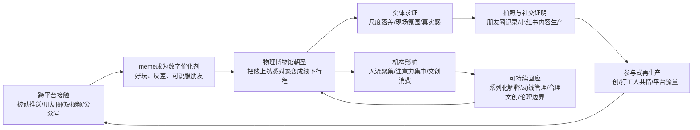

# 主题关系图

```mermaid
flowchart LR
  A["跨平台接触<br/>被动推送/朋友圈/短视频/公众号"] --> B["meme成为数字催化剂<br/>好玩、反差、可说服朋友"]
  B --> C["物理博物馆朝圣<br/>把线上熟悉对象变成线下行程"]
  C --> D["实体求证<br/>尺度落差/现场氛围/真实感"]
  D --> E["拍照与社交证明<br/>朋友圈记录/小红书内容生产"]
  E --> F["参与式再生产<br/>二创/打工人共情/平台流量"]
  F --> A
  C --> G["机构影响<br/>人流聚集/注意力集中/文创消费"]
  G --> H["可持续回应<br/>系列化解释/动线管理/合理文创/伦理边界"]
  H --> C
```
